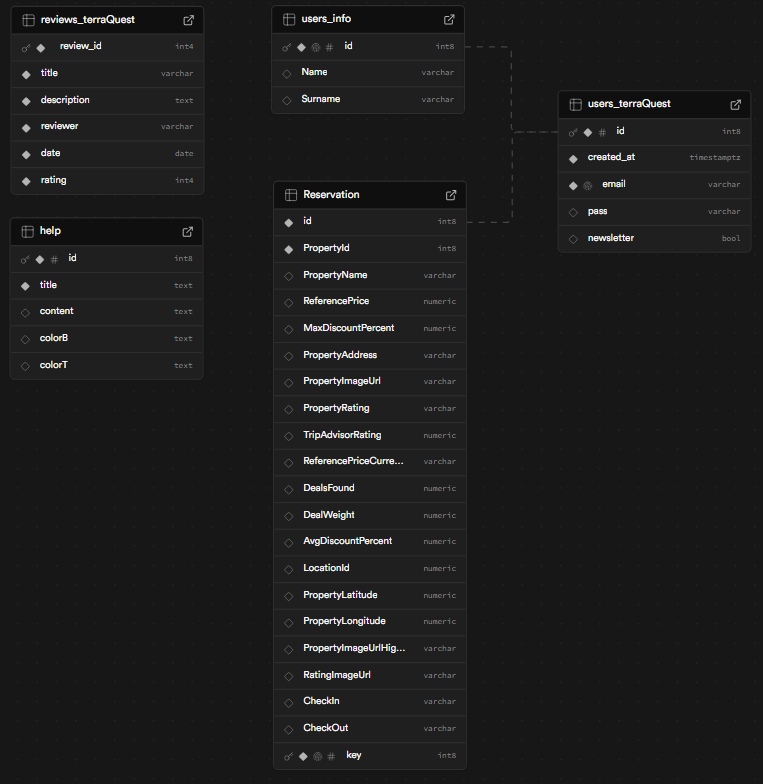

<div style="display: flex; align-items: center; gap: 10px;">
  
  <h1 style="color:gold; margin: 0;">TerraQuest</h1>
</div>

TerraQuest to platforma rezerwacyjna, która umożliwia użytkownikom łatwe wyszukiwanie, rezerwowanie oraz ocenianie obiektów noclegowych takich jak hotele, apartamenty, hostele i inne. Dzięki TerraQuest użytkownicy mogą szybko i wygodnie znaleźć idealne miejsce na wypoczynek, a także zarządzać swoimi rezerwacjami w jednym miejscu.

Nasza platforma oferuje intuicyjny interfejs, system oceny obiektów oraz filtry wyszukiwania, wszystko po to, aby ułatwić użytkownikom planowanie podróży i rezerwację noclegów.

---

# 🔧 Technologie

- **Frontend:** React.js, SCSS
- **Backend:** Node.js, Express.js
- **Testy:** Jest, React Testing Library, TypeScript, ts-jest, Supertest
- **Baza danych:** Supabase

---

# 🧑‍💻 Funkcjonalności

- ✅ **Rejestracja i logowanie użytkownika**  
  Użytkownicy mogą się zarejestrować, zalogować i zarządzać swoimi danymi.

- ✅ **Niezwykłe oferty promocyjne**  
  Użytkownicy mogą się otrzymać spersonalizowaną ofertę promocyjną, poprzez zapisanie się do Newslettera.

- ✅ **Wyszukiwanie dostępnych obiektów**  
  Użytkownicy mogą wyszukiwać dostępne hotele, apartamenty i inne obiekty według daty, lokalizacji, ceny i oceny.

- ✅ **Rezerwacja obiektów**  
  Użytkownicy mogą dokonywać rezerwacji obiektów na określony czas.

- ✅ **Zarządzanie rezerwacjami**  
  Użytkownicy mogą przeglądać lub anulować swoje rezerwacje.

- ✅ **Ocenianie i recenzowanie obiektów**  
  Po zakończeniu pobytu użytkownicy mogą oceniać obiekty oraz zostawiać opinie.

- ✅ **Filtrowanie obiektów po różnych kryteriach**  
  Możliwość filtrowania obiektów np. po cenie, ocenie, rodzaju zniżki.

- ✅ **Sortowanie obiektów po różnych kryteriach**  
  Możliwość przyjrzystego i łatwego sortowania obiektów np. po cenie malejącej, ocenie rosnącej, nowe oferty oraz najlepsze oferty.

- ✅ **Bezpieczne przechowywanie haseł (bcrypt)**  
  Hasła użytkowników są bezpiecznie przechowywane przy pomocy algorytmu `bcryptjs`.

- ✅ **Podstawowa administracja**  
  Administratorzy mogą zarządzać obiektami (dodawanie nowych, edytowanie, usuwanie).

---

# ⚙️ Instalacja
**📥 Krok 1 – Klonowanie repozytorium**
   ```bash
      git clone https://github.com/BergFilip/TerraQuest_web.git
   ```
**⬇️ Krok 2 – Przejście do projektu**
   ```bash
      cd TerraQuest
   ```
**⬇️ Krok 3 - Przejście do backendu**
  ```bash
    cd Backend
  ```
**📦 Krok 4 – Instalacja zależności**
   ```bash
      npm install
   ```
**▶️ Krok 5 – Uruchomienie Backendu**
   ```bash
      npm run dev
   ```
**⬇️ Krok 6 – Przejście do frontendu**
   ```bash
      cd ../Frontend
   ```
**📦 Krok 7 – Instalacja zależności**
   ```bash
      npm install
   ```
**▶️ Krok 8 – Uruchomienie Frontendu**
   ```bash
      npm run dev
   ```
**🌐 Po chwili aplikacja będzie dostępna pod adresem:**
   ```bash
      http://localhost:5173
   ```
---

# Podział pracy w projekcie TerraQuest

## Frontend:

### `src`

- **App.scss**: [Każdy]
- **App.tsx**: [Każdy]
- **index.scss**: [Każdy]
- **main.tsx**: [Każdy]

#### `sites`
- **About.tsx**: [Filip]
- **Contact.tsx**: [Filip]
- **Error.tsx**: [Filip]
- **Explore.tsx**: [Wiktor]
- **Help.tsx**: [Filip]
- **Home.tsx**: [Wiktor]
- **Login.tsx**: [Wiktor]
- **Newsletter.tsx**: [Filip]
- **Privacy_policy.tsx**: [Wiktor]
- **Product.tsx**: [Jacek]
- **Registration.tsx**: [Wiktor]
- **Search.tsx**: [Jacek]
- **User.tsx**: [Jacek]
- **Weather.tsx**: [Filip]

#### `styles`
- **About.scss**: [Filip]
- **Contact.scss**: [Filip]
- **Explore.scss**: [Wiktor]
- **Error.scss**: [Filip]
- **Help.scss**: [Filip]
- **Home.scss**: [Wiktor]
- **Login.scss**: [Wiktor]
- **Newsletter.scss**: [Filip]
- **Privacy_policy.scss**: [Wiktor]
- **Product.scss**: [Jacek]
- **Register.scss**: [Wiktor]
- **Search.scss**: [Jacek]
- **User.scss**: [Jacek]
- **Weather.scss**: [Filip]

---

## Backend:

- **auth.ts**: [Filip]
- **explore.ts**: [Wiktor]
- **newsletter.ts**: [Wiktor]
- **reviews.ts**: [Wiktor]
- **supabase.ts**: [Każdy]
- **reservation.ts**: [Filip]
- **userBookings.ts**: [Filip]
- **product.ts**: [Wiktor]
- **help1.ts**: [Jacek]
- **main.ts**: [Jacek]
- **supabaseClient.ts**: [Wiktor / Filip]

---

## Baza danych

- **Supabase** [Każdy] 
- **users_terraQuest** [Wiktor] 
- **reviews_terraQuest** [Wiktor] 
- **help** [Jacek] 
- **Reservation** [Filip] 
- **users_info** [Filip] <br><br>



---

## Testowanie

### Frontend
- **About.test.tsx**: [Filip]
- **Contact.test.tsx**: [Filip]
- **Error.test.tsx**: [Filip]
- **Explore.test.tsx**: [Wiktor]
- **Help.test.test.tsx**: [Filip]
- **Home.test.tsx**: [Wiktor]
- **Login.test.tsx**: [Wiktor]
- **Newsletter.test.tsx**: [Filip]
- **Privacy_policy.test.tsx**: [Wiktor]
- **Product.test.tsx**: [Jacek]
- **Registration.test.tsx**: [Wiktor]
- **Search.test.tsx**: [Jacek]
- **User.test.tsx**: [Jacek]
- **Weather.test.tsx**: [Filip]

### Backend

- **auth.ts**: [Filip]
- **explore.ts**: [Wiktor]
- **newsletter.ts**: [Wiktor]
- **reviews.ts**: [Wiktor]
- **supabase.ts**: [Każdy]
- **reservation.ts**: [Filip]
- **userBookings.ts**: [Filip]
- **product.ts**: [Wiktor]
- **help1.ts**: [Jacek]
- **main.ts**: [Jacek]
- **supabaseClient.ts**: [Wiktor / Filip]

---

## Dokumentacja

- **Przygotowanie dokumentacji technicznej**: [Każdy]

---
  
  # 🌐 Opis podstron / backendu
  
  ## Frontend:
  
  ### 🧩 `App.tsx`
- **Opis**:  
  Główny komponent aplikacji React, odpowiedzialny za konfigurację routingu przy użyciu `react-router-dom`. Renderuje nagłówek (`Header`), stopkę (`Footer`) oraz zawartość główną opartą o aktualną ścieżkę URL.

---

## 📄 Lista podstron:

| Ścieżka                  | Komponent               | Opis                                                                 |
|--------------------------|-------------------------|----------------------------------------------------------------------|
| `/` / `/home`            | `Home.tsx`              | 🏠 Strona główna aplikacji                                           |
| `/privacypolicies`       | `Privacy_policy.tsx`    | 🔒 Polityka prywatności                                              |
| `/newsletter`            | `Newsletter.tsx`        | 📰 Zapis do newslettera                                              |
| `/about`                 | `About.tsx`             | ℹ️ Informacje o firmie/projekcie                                     |
| `/product/:hotelId`      | `Product.tsx`           | 🏨 Szczegóły konkretnego produktu (dynamiczne ID)                    |
| `/help`                  | `Help.tsx`              | ❓ Centrum pomocy / FAQ                                               |
| `/user`                  | `User.tsx`              | 👤 Panel użytkownika                                                 |
| `/contact`               | `Contact.tsx`           | 📬 Formularz kontaktowy                                              |
| `/login`                 | `Login.tsx`             | 🔐 Logowanie użytkownika                                             |
| `/register`              | `Registration.tsx`      | 📝 Rejestracja nowego użytkownika                                    |
| `/weather`               | `Weather.tsx`           | ☀️ Pogoda zintegrowana z zewnętrznym API                            |
| `/explore`               | `Explore.tsx`           | 🌍 Eksploracja dostępnych miejsc/ofert                               |
| `/search`                | `Search.tsx`            | 🔍 Wyszukiwanie zawartości                                           |
| `/error`                 | `Error.tsx`             | ⚠️ Wyświetlana w przypadku błędnej ścieżki                          |
| `*`                      | `Navigate -> /error`    | 🔁 Przekierowanie każdej innej ścieżki do strony błędu              |

---

## 🧱 Układ aplikacji

- **`<Header />`** – stały pasek nawigacji u góry
- **`<Footer />`** – globalna stopka aplikacji
- **`<Routes>`** – dynamiczna zawartość główna na podstawie adresu URL

---

### 🌐 `main.tsx`
- **Opis**:  
  Główny punkt wejściowy aplikacji React. Odpowiada za renderowanie komponentu głównego do drzewa DOM oraz konfigurację podstawowych dostawców kontekstu i routingu.
- **Funkcje**:
  - Montowanie komponentu <App /> do elementu DOM o id root
  - Otoczenie aplikacji w React.StrictMode – tryb pomocny w wykrywaniu potencjalnych problemów
  - Konfiguracja klienta routingu za pomocą BrowserRouter z react-router-dom
  - Dostarczenie kontekstu uwierzytelniania za pomocą AuthProvider
---

### 📘 `About.tsx`
- **Opis**:  
  Główna strona informacyjna aplikacji TerraQuest, przedstawiająca jej misję, historię i kluczowe dane.
- **Zawiera**: tekst + ilustracje
- **Funkcje**:
  - Prezentacja misji oraz wartości marki TerraQuest
  - Opis funkcjonalności i unikalnych cech platformy
  - Wyświetlenie danych statystycznych (kraje, języki, strony itp.)
  - Oś czasu z kluczowymi wydarzeniami w historii rozwoju firmy
---

### 📩 `Contact.tsx`
- **Opis**:  
  Strona kontaktowa aplikacji TerraQuest. Udostępnia użytkownikom możliwość wysłania wiadomości poprzez formularz.
- **Funkcje**:
  - Wyświetlenie formularza kontaktowego
  - Możliwość wysłania wiadomości

---

### 🚧 `Error.tsx`
- **Opis**:  
  Strona błędu 404, wyświetlana gdy użytkownik trafi na nieistniejącą trasę w aplikacji TerraQuest.
- **Funkcje**:
  - Informowanie użytkownika o braku dostępnej strony
  - Wyświetlenie przycisku nawigującego z powrotem do strony głównej

---

### 🔍 `Explore.tsx`
- **Opis**:  
  Strona eksploracji ofert hotelowych z formularzem wyszukiwania, listą promowanych hoteli i opiniami klientów.
- **Funkcje**:
  - Pobieranie i wyświetlanie hoteli oraz recenzji z API
  - Przeliczanie cen na PLN, paginacja ofert
  - Formularz z nawigacją do /search
  - Sekcja promocyjna i baner aplikacji

---

### ❓ `Help.tsx`
- **Opis**:  
  Strona pomocy z wyszukiwarką pytań i odpowiedzi (FAQ).
- **Funkcje**:
  - Obsługa pola wyszukiwania zapytań
  - Dynamiczne filtrowanie sekcji FAQ (FaqSection)

---

### 🏠 `Home.tsx`
- **Opis**:  
  Strona główna aplikacji turystycznej — prezentuje oferty, cele podróży, inspiracje i sekcję FAQ.
- **Zawiera**:
  - Formularz wyszukiwania z obsługą localStorage i przekierowaniem
  - Dynamiczne ładowanie hoteli z API 
  - Wiele sekcji podróżniczych z komponentami 
  - Automatyczne przeliczanie waluty (USD/EUR → PLN)
  - Nawigacja i paginacja wyników hoteli

---

### 🔐 `Login.tsx`
- **Opis**:  
  Formularz logowania użytkownika do aplikacji, z walidacją, obsługą błędów i integracją z backendem.
- **Funkcje**:
  - Logowanie za pomocą emaila i hasła
  - Obsługa błędów serwera i wyświetlanie komunikatów
  - Przekierowanie po zalogowaniu do /user
  - Integracja z kontekstem autoryzacji useAuth()
  - Link do strony rejestracji /register

---

### 📬 `Newsletter.tsx`
- **Opis**:  
  Formularz do zapisania użytkownika do newslettera, z walidacją emaila, obsługą błędów, i sprawdzeniem logowania.
- **Funkcje**:
  - Sprawdzenie, czy użytkownik jest zalogowany
  - Walidacja poprawności adresu email
  - Obsługa błędów
  - Możliwość edytowania swojego adresu email w przypadku zalogowania
  - Przekierowanie do strony logowania, jeśli użytkownik nie jest zalogowany

---

### 🛡️ `Privacy_policy.tsx`
- **Opis**:  
  Strona przedstawiająca Politykę Prywatności aplikacji TravelQuest.
- **Funkcje**:
  - Wyświetlanie podstawowych informacji o firmie 
  - Szczegółowy opis przetwarzania danych osobowych
  - Możliwość kontaktu z administratorem poprzez e-mail, telefon lub adres firmy.

---

### 📦 `Product.tsx`
- **Opis**:  
  Strona prezentacji szczegółów hotelu z funkcją rezerwacji i przeglądem recenzji użytkowników.
- **Funkcje**:
  - Pobieranie danych z API
  - Wyświetlanie szczegółów

---

### 📝 `Registration.tsx`
- **Opis**:  
  Rejestracja nowego użytkownika
- **Funkcje**:
  - Wyświetlanie szczegółowych informacji o hotelu.
  - Możliwość rezerwacji hotelu tylko dla zalogowanych użytkowników.
  - Dynamiczne przeliczanie cen z USD i EUR na PLN według ustalonych kursów walutowych.
  - Ładowanie i wyświetlanie recenzji od innych użytkowników oraz prezentacja statystyk z ocenami.

---

### 🔎 `Search.tsx`
- **Opis**:  
  Strona do wyszukiwania ofert
- **Funkcje**:
  - Wyświetlanie informacji o hotelach
  - Możliwość sortowania lokali
  - Przejście do szczegółów wybranego hotelu i możliwość dokonania rezerwacji

---

### 👤 `User.tsx`
- **Opis**:  
  Strona panelu użytkownika systemu rezerwacji hoteli, umożliwiająca zarządzanie profilem oraz przeglądanie historii rezerwacji.
- **Funkcje**:
  - Wyświetlanie danych użytkownika
  - Aktualizacja danych profilowych
  - Zarządzanie subskrypcją newslettera
  - Funkcja wylogowania

---

### ☀️ `Weather.tsx`
- **Opis**:  
  Praca wtoku

---
# 🌐 Opis testów

## Backend:

### 🧪 Auth.test.ts – [Testy endpointów autentykacji]
**Opis**:
Testy jednostkowe i integracyjne dla endpointów autentykacji (/register, /login, /logout). Sprawdzają poprawność walidacji danych, integrację z Supabase oraz generowanie tokenów JWT.

**Funkcje**:

  - Testowanie walidacji emaila (validateEmail) dla poprawnych i niepoprawnych formatów
  - Testowanie walidacji hasła (validatePassword) zgodnie z wymaganiami bezpieczeństwa
  - Testowanie rejestracji użytkownika (/register) z uwzględnieniem:
  - Sukcesywnej rejestracji z poprawnymi danymi
  - Odrzucenia słabego hasła
  - Obsługi istniejącego użytkownika
  - Poprawnego logowania z właściwymi danymi
  - Odrzucenia nieprawidłowych danych
  - Testowanie wylogowania (/logout) i czyszczenia sesji
  - Mockowanie zależności (Supabase, bcrypt, JWT) dla izolacji testów

**Zależności**:

  - supertest – testowanie endpointów HTTP
  - express – serwer testowy
  - jest – framework testowy i mockowanie
  - bcryptjs – mockowanie funkcji hashujących
  - jsonwebtoken – mockowanie tokenów JWT
  - supabase – mockowanie operacji bazodanowych
  - ../other/auth – testowany router autentykacji

---

### 🧪 Help1.test.ts – [Testy endpointów FAQ]
**Opis**:
esty integracyjne dla endpointów FAQ (/api/help1/faq). Weryfikują poprawność pobierania danych z Supabase, obsługę błędów oraz zwracanie odpowiednich kodów statusu HTTP.

**Funkcje**:

- Testowanie poprawnego zwracania listy FAQ z bazy danych
- Weryfikacja struktury danych odpowiedzi (tytuł, treść, kolory)
- Mockowanie Supabase Clienta dla izolacji testów
- Czyszczenie mocków po każdym teście (afterEach)

**Zależności**:

- supertest – testowanie endpointów HTTP
- express – serwer testowy
- jest – framework testowy i mockowanie
- ../supabaseClient – mockowany klient Supabase
- ../routes/help1 – testowany router FAQ

---

### 🧪 Main.test.ts – [Testy głównej aplikacji]
**Opis**:
esty integracyjne sprawdzające podstawową funkcjonalność głównego serwera aplikacji. Weryfikują poprawność działania endpointu głównego oraz obsługę nieznanych ścieżek.

**Funkcje**:

- Testowanie poprawnej odpowiedzi na żądanie GET / (health check)
- Weryfikacja statusu 200 i komunikatu potwierdzającego działanie backendu
- Testowanie obsługi nieistniejących ścieżek (404 Not Found)
- Sprawdzenie czy aplikacja poprawnie inicjalizuje się i odpowiada na żądania

**Zależności**:

- supertest – testowanie endpointów HTTP
- express – serwer testowy
- jest – framework testowy i mockowanie

---

### 🧪 Newsletter.test.ts – [Testy głównej aplikacji]
**Opis**:
Kompleksowe testy integracyjne endpointu zapisu do newslettera. Weryfikują poprawność walidacji danych, integrację z Supabase oraz wszystkie możliwe scenariusze odpowiedzi.

**Funkcje**:

- Testowanie walidacji adresu email (wymagane pole, format)
- Obsługa różnych przypadków użytkownika
- Testowanie niestandardowych przypadków ( adresy z wielkimi literami, adresy z polskimi znakami ...)
- Mockowanie Supabase Clienta dla izolacji testów

**Zależności**:

- supertest – testowanie endpointów HTTP
- express – serwer testowy
- jest – framework testowy i mockowanie
- ../utils/supabase – mockowany klient Supabase
- ../routes/newsletter – testowany router newslettera

---

### 🧪 Product.test.ts – [Testy endpointów hotelowych]
**Opis**:
Kompleksowe testy integracyjne dla endpointów związanych z wyszukiwaniem i szczegółami hoteli. Weryfikują poprawność integracji z zewnętrznym API, walidację parametrów oraz obsługę różnych scenariuszy odpowiedzi.

**Funkcje**:

- Testowanie walidacji parametrów (wymagane pole 'city')
- Weryfikacja struktury odpowiedzi dla szczegółów hotelu
- Mockowanie axios dla izolacji testów
- Testowanie obsługi błędów
- Obsługa różnych formatów odpowiedzi z API

**Zależności**:

- supertest – testowanie endpointów HTTP
- express – serwer testowy
- jest – framework testowy i mockowanie
- axios – mockowane żądania HTTP
- ../routes/product – testowany router hotelowy

---

### 🧪 Reservation.test.ts – [Testy endpointów rezerwacji]
**Opis**:
Kompleksowe testy procesu rezerwacji hoteli, weryfikujące poprawność walidacji danych, integrację z bazą danych oraz obsługę wszystkich scenariuszy biznesowych i błędów.

**Funkcje**:

- Walidacja wymaganych pól (email, dane hotelu)
- Wyszukiwanie użytkownika w Supabase
- Zapis pełnych danych rezerwacji
- Generowanie odpowiedzi dla klienta

**Zależności**:

- supertest – testowanie endpointów HTTP
- express – serwer testowy
- jest – framework testowy i mockowanie
- ../utils/supabase – mockowany klient Supabase
- ../other/reservation – Testowany router rezerwacji

---

### 🧪 Reviews.test.ts – [Testy endpointu recenzji]
**Opis**:
Testy weryfikujące działanie endpointu pobierającego recenzje, z uwzględnieniem przypisywania odpowiednich obrazków w zależności od płci recenzenta oraz obsługi różnych przypadków brzegowych.

**Funkcje**:

- Pobieranie listy recenzji z bazy danych
- Automatyczne przypisywanie obrazków na podstawie imienia recenzent
- Obsługa przypadków specjalnych (brak imienia, undefined)
- Zwracanie odpowiednich kodów błędów

**Zależności**:

- supertest – testowanie endpointów HTTP
- express – serwer testowy
- jest – framework testowy i mockowanie
- ../supabaseClient – mockowany klient Supabase
- ../routes/reviews – testowany router recenzji

---

### 🧪 Supabase.test.ts – [Testy inicjalizacji klienta Supabase]
**Opis**:
Testy weryfikujące poprawność konfiguracji i inicjalizacji klienta Supabase, w tym obsługę błędów przy braku wymaganych zmiennych środowiskowych.

**Funkcje**:

- Walidacja obecności wymaganych zmiennych środowiskowych
- Poprawna inicjalizacja klienta Supabase
- Obsługa błędów konfiguracji

**Zależności**:

- supertest – testowanie endpointów HTTP
- express – serwer testowy
- jest – framework testowy i mockowanie
- Node.js process.env – zarządzanie zmiennymi środowiskowymi

---

### 🧪 UserBookings.test.ts – [Testy endpointów rezerwacji użytkownika]

**Opis**:
Testy weryfikujące działanie endpointów związanych z zarządzaniem rezerwacjami użytkowników, w tym pobieranie listy rezerwacji oraz ich usuwanie. Testy pokrywają zarówno ścieżki sukcesu, jak i obsługę błędów.

**Funkcje**:

- Pobieranie rezerwacji na podstawie userId
- Walidacja wymaganych parametrów
- Autoryzacja przy usuwaniu rezerwacji
- Obsługa błędów bazy danych
- Reakcja na brak tokenu JWT

**Zależności**:

- supertest – testowanie endpointów HTTP
- express – serwer testowy
- jsonwebtoken - Mockowana weryfikacja tokenów
- ../utils/supabase - Mockowany klient Supabase
- ../other/userBookings - Testowany router

---

## Frontend:


### 🧪 About.test.tsx – [Testy komponentu About]
**Opis:**  
Testy jednostkowe dla komponentu `About`. Sprawdzają poprawność renderowania treści, obecność kluczowych sekcji oraz integrację z komponentem `Button`.

**Funkcje:**
- Sprawdzenie poprawnego renderowania komponentu About bez błędów
- Weryfikacja obecności tekstów i nagłówków (Nasza misja, O TerraQuest, itd.)
- Testowanie tekstu misji i opisu TerraQuest
- Sprawdzenie poprawności renderowania sekcji statystyk i osi czasu
- Testowanie obecności i treści przycisków (mockowanie komponentu `Button`)
- Walidacja obecności klas CSS w drzewie DOM

**Zależności:**
- `@testing-library/react` – renderowanie komponentów i selektory
- `jest` – mockowanie komponentów
- `../sites/About.tsx` – testowany komponent
- `@components/Button.tsx` – mockowany komponent przycisku

---

### 🧪 AuthContext.test.tsx – [Testy kontekstu uwierzytelnienia]
**Opis:**  
Testy logiki kontekstu `AuthContext`. Weryfikują domyślne wartości, funkcje logowania, wylogowania i autoryzacji użytkownika oraz reakcję na odpowiedzi API.

**Funkcje:**
- Sprawdzenie początkowego stanu (`isLoggedIn`, dane użytkownika)
- Obsługa błędnego użycia `useAuth` poza `AuthProvider`
- Symulacja logowania i aktualizacji danych użytkownika
- Wylogowanie i reset stanu
- Sprawdzenie autoryzacji przy montażu i kliknięciu przycisku
- Obsługa błędów (np. brak autoryzacji, błąd sieci)
- Ustawianie pól użytkownika przez odpowiednie funkcje

**Zależności:**
- `@testing-library/react`, `@testing-library/jest-dom` – testowanie komponentów i selektorów
- `jest` – mockowanie funkcji `fetch`
- `../context/AuthContext.tsx` – kontekst do testów
- `global.fetch` – zamockowany endpoint `http://localhost:5000/api/auth/user`

---

### 🧪 Contact.test.tsx – [Testy komponentu Contact]
**Opis:**  
Testy komponentu `Contact`. Sprawdzają poprawność renderowania struktury oraz integrację z formularzem kontaktowym.

**Funkcje:**
- Renderowanie komponentu bez błędów
- Walidacja obecności głównych sekcji i klas CSS
- Sprawdzenie obecności komponentu `ContactForm` (mockowany)
- Weryfikacja, że do `ContactForm` nie są przekazywane żadne propsy

**Zależności:**
- `@testing-library/react` – renderowanie i selektory
- `jest` – mockowanie komponentu `ContactForm`
- `../sites/Contact.tsx` – testowany komponent
- `@components/ContactForm.tsx` – mockowany formularz kontaktowy

---

### 🧪 Error.test.tsx – [Testy komponentu Error]
**Opis:**  
Testy komponentu `Error`, który wyświetla komunikat o błędnej stronie oraz przycisk powrotu. Sprawdzana jest zawartość, poprawność przekazywanych propsów i klasy CSS.

**Funkcje:**
- Renderowanie komponentu z komunikatem i przyciskiem
- Sprawdzenie treści i atrybutów przycisku `Powrót`
- Walidacja przekazywanych propsów do zamockowanego `Button`
- Sprawdzenie obecności klas `.error` i `.back`

**Zależności:**
- `@testing-library/react` – renderowanie komponentów i selektory
- `jest` – mockowanie komponentu `Button`
- `../sites/Error.tsx` – testowany komponent
- `@components/Button.tsx` – mockowany komponent przycisku

---
### 📄 Explore.test.tsx – [Testy komponentu Explore]
**Opis:**  
Testy komponentu `Explore`, który wyświetla listę hoteli, sekcję recenzji oraz formularz wyszukiwania. Sprawdzane są stany ładowania, nawigacja, paginacja i przeliczanie cen.

**Funkcje:**
- Renderowanie komponentu z nagłówkiem
- Pobieranie hoteli i recenzji z API (`axios`)
- Obsługa formularza i zapis danych do `localStorage`
- Przekierowanie użytkownika po wyszukaniu (`/search`)
- Kliknięcie hotelu i przejście do strony produktu
- Obsługa paginacji i blokowanie przycisków
- Stany ładowania i błędów
- Wyświetlanie przeliczonych cen (np. USD → PLN)
- Formatowanie zakresu dat w nagłówku

**Zależności:**
- `@testing-library/react`, `@testing-library/jest-dom` – renderowanie, selektory, asercje
- `jest` – mockowanie `axios`, `useNavigate` z `react-router-dom`
- `../sites/Explore.tsx` – testowany komponent

---

### 📄 Help.test.tsx – [Testy komponentu Help]
**Opis:**  
Testy komponentu `Help`, który zawiera wyszukiwarkę pytań i sekcję FAQ. Weryfikowana jest obsługa inputa, przekazywanie frazy do komponentu oraz struktura strony.

**Funkcje:**
- Renderowanie komponentu z nagłówkiem i inputem
- Obsługa wpisywanego tekstu
- Przekazywanie wartości inputa do zamockowanego `FaqSection`
- Obecność ikony wyszukiwania
- Weryfikacja klas CSS i struktury DOM

**Zależności:**
- `@testing-library/react`, `@testing-library/jest-dom` – renderowanie, zdarzenia, selektory
- `jest` – mock `../components/help_section.tsx`
- `../sites/Help.tsx` – testowany komponent

---

### 📄 Home.test.tsx – [Testy komponentu Home]
**Opis:**  
Testy komponentu `Home`, zawierającego formularz wyszukiwania i listę promowanych hoteli. Sprawdzane jest ładowanie danych, paginacja oraz struktura formularza.

**Funkcje:**
- Renderowanie formularza z polami i przyciskiem
- Pobieranie danych hoteli z API (`axios`)
- Wyświetlanie komunikatu ładowania przed otrzymaniem danych
- Obsługa przycisków paginacji i zmiana widocznych hoteli

**Zależności:**
- `@testing-library/react`, `@testing-library/jest-dom` – testowanie komponentów i interakcji
- `jest` – mock `axios`
- `react-router-dom` – `MemoryRouter` do testowania routingu
- `../sites/Home.tsx` – testowany komponent

---

### 📄 Login.test.tsx – [Testy komponentu Login]
**Opis:**  
Testy komponentu `Login`, odpowiedzialnego za logowanie użytkownika. Testowane są interakcje z formularzem, obsługa błędów oraz przekierowania po zalogowaniu.

**Funkcje:**
- Renderowanie inputów i przycisków formularza logowania
- Wprowadzanie danych do pól formularza
- Symulacja udanego logowania i przekierowania do `/user`
- Obsługa niepoprawnych danych i wyświetlanie komunikatu o błędzie
- Obsługa błędów sieci i wyświetlanie komunikatu ogólnego

**Zależności:**
- `@testing-library/react`, `@testing-library/jest-dom` – testowanie renderowania i interakcji
- `jest` – mockowanie `useAuth`, `useNavigate` z `react-router-dom`, `fetch`
- `../sites/Login.tsx` – testowany komponent

---

### 📄 Newsletter.test.tsx – [Testy komponentu Newsletter]
**Opis:**  
Testy komponentu `Newsletter`, który umożliwia zapis do newslettera. Weryfikowane są atrybuty pól, stylizacja, stan początkowy oraz dostępność formularza.

**Funkcje:**
- Renderowanie formularza zapisu z etykietami i przyciskiem
- Prefill pola e-mail, gdy użytkownik jest zalogowany
- Sprawdzenie poprawnych atrybutów inputa i przycisku
- Weryfikacja klas CSS kontenera głównego i wrappera inputa
- Sprawdzenie dostępności formularza (aria-label)
- Brak alertu przy początkowym renderze

**Zależności:**
- `@testing-library/react`, `@testing-library/jest-dom` – renderowanie, selektory, atrybuty
- `jest` – mockowanie `useAuth`, `useNavigate`, `fetch`
- `../sites/Newsletter.tsx` – testowany komponent

---

### 📄 PrivacyPolicies.test.tsx – [Testy komponentu PrivacyPolicies]
**Opis:**  
Testy komponentu `PrivacyPolicies`, renderującego politykę prywatności. Sprawdzana jest obecność nagłówków, sekcji, danych kontaktowych i dat.

**Funkcje:**
- Renderowanie tytułu strony i nagłówka "Polityka Prywatności"
- Wyświetlanie dat wejścia w życie i ostatniej aktualizacji
- Renderowanie sekcji informacyjnych, np. "Postanowienia ogólne"
- Wyświetlanie danych kontaktowych: e-mail, telefon, adres
- Obecność sekcji dotyczącej plików cookies

**Zależności:**
- `@testing-library/react` – renderowanie i selektory
- `@testing-library/jest-dom` – asercje
- `../sites/Privacy_policy.tsx` – testowany komponent

---

### 📄 Product.test.tsx – [Testy komponentu Product]
**Opis:**  
Testy komponentu `Product`, który renderuje szczegóły hotelu, w tym informacje o hotelu, udogodnienia, recenzje, oraz obsługę rezerwacji. Testowane są funkcje związane z ładowaniem danych, wyświetlaniem informacji, oraz rezerwacją.

**Funkcje:**
- Renderowanie stanu ładowania danych hotelu i recenzji
- Wyświetlanie szczegółów hotelu, w tym nazwa, adres, cena, i ocena
- Renderowanie sekcji udogodnień hotelu
- Wyświetlanie opisu hotelu
- Ładowanie recenzji z API
- Obsługa rezerwacji hotelu przez użytkownika
- Wyświetlanie komunikatów o błędach przy nieudanej rezerwacji
- Obliczanie cen po zniżkach

**Zależności:**
- `@testing-library/react`, `@testing-library/jest-dom` – renderowanie, selektory, atrybuty
- `jest` – mockowanie `useAuth`, `axios`, `Storage`, `fetch`
- `../sites/Product.tsx` – testowany komponent
- `../context/AuthContext` – mockowany kontekst autoryzacji
- `axios` – mockowanie zapytań HTTP

---

### 📄 Register.test.tsx – [Testy komponentu Register]
**Opis:**  
Testy komponentu `Register`, który odpowiada za rejestrację użytkownika. Testowane są interakcje z formularzem rejestracyjnym, w tym pola input, checkbox i przycisk.

**Funkcje:**
- Renderowanie formularza rejestracyjnego z polami `email`, `hasło`, `checkbox` oraz przyciskiem
- Weryfikacja możliwości wpisywania danych w polach email i hasło
- Sprawdzenie stanu checkboxa (czy jest zaznaczony)
- Testowanie renderowania formularza w kontekście routera i autoryzacji

**Zależności:**
- `@testing-library/react`, `@testing-library/jest-dom` – testowanie interakcji i renderowania
- `jest` – mockowanie funkcji `fetch`, `AuthProvider`, `BrowserRouter`
- `../sites/Registration.tsx` – testowany komponent
- `../context/AuthContext` – kontekst autoryzacji

---
### 📄 Search.test.tsx – [Testy komponentu Search]

Opis:
Testy komponentu Search, który odpowiada za wyszukiwanie hoteli. Testowane są interakcje z formularzem wyszukiwania, filtrowanie wyników oraz poprawność nawigacji.

Funkcje:

- Renderowanie formularza wyszukiwania z polami na miejsce docelowe, daty wyjazdu, liczby osób.
- Testowanie wczytywania zapisanych parametrów wyszukiwania z localStorage.
- Testowanie przesyłania formularza i wywoływania zapytań do API w celu pobrania wyników.
- Sprawdzanie poprawności filtrów według ceny, oceny oraz rabatów.
- Testowanie sortowania wyników według ceny (rosnąco/malejąco) oraz oceny.
- Testowanie nawigacji do szczegółów oferty po kliknięciu przycisku "Zobacz ofertę".
- Obsługa stanu ładowania oraz braku wyników.

Zależności:

- @testing-library/react, @testing-library/jest-dom – testowanie interakcji i renderowania
- jest – mockowanie funkcji axios, localStorage i hooków
- ../sites/Search.tsx – testowany komponent
- axios – do mockowania zapytań HTTP
- react-router-dom – do mockowania nawigacji

---

### 📄 User.test.tsx – [Testy komponentu User]

Opis:
Testy komponentu User, który odpowiada za wyświetlanie danych użytkownika oraz jego rezerwacji. Testowane są interakcje z danymi użytkownika, stan logowania oraz możliwość wylogowania.

Funkcje:

- Weryfikacja poprawności stanu użytkownika (zalogowany/niezalogowany).
- Testowanie renderowania danych użytkownika (imię, nazwisko, email).
- Testowanie wyświetlania rezerwacji użytkownika, w tym szczegóły rezerwacji.
- Testowanie możliwości wylogowania i przekierowania na stronę logowania.
- Testowanie stanu ładowania przy weryfikacji sesji.
- Sprawdzanie, czy użytkownik, który nie jest zalogowany, zostaje przekierowany na stronę logowania.

Zależności:

- @testing-library/react, @testing-library/jest-dom – testowanie interakcji i renderowania
- jest – mockowanie funkcji axios oraz hooków
- ../sites/User.tsx – testowany komponent
- ../context/AuthContext – kontekst autoryzacji
- react-router-dom – do mockowania nawigacji
- axios – do mockowania zapytań HTTP

---

### 📄 Weather.test.tsx – [Testy komponentu Weather]

Opis:
Testy komponentu Weather, który wyświetla informacje o dostępności strony z prognozą pogody. Testowane są interakcje z przyciskiem powrotu na stronę główną oraz renderowanie komunikatu o niedostępności strony.

Funkcje:

- Renderowanie komunikatu o niedostępności strony z prognozą pogody.
- Testowanie renderowania przycisku powrotu na stronę główną.
- Testowanie poprawności przekazywanych propsów do komponentu Button.

Zależności:

- @testing-library/react, @testing-library/jest-dom – testowanie interakcji i renderowania
- jest – mockowanie przycisku powrotu
- ../sites/Weather.tsx – testowany komponent
- @components/Button.tsx – mockowany komponent przycisku

---

## Makieta projektu - Figma:
Opis:
Makieta projektu w Figma to wizualne odwzorowanie interfejsu użytkownika aplikacji lub strony internetowej. Dokumentacja ta przedstawia sposób korzystania z makiety w Figma, jej cele, funkcje oraz strukturę, jak również zapewnia informacje dotyczące współpracy zespołowej i organizacji projektu w Figma.

https://www.figma.com/design/VAEeMmg1rGRkZhTuEwuFnK/Platforma-do-Planowania-Podróży-i-Rezerwacji---TerraQuest?node-id=0-1&t=TFYAgNNcLLNpHKD8-1
---


